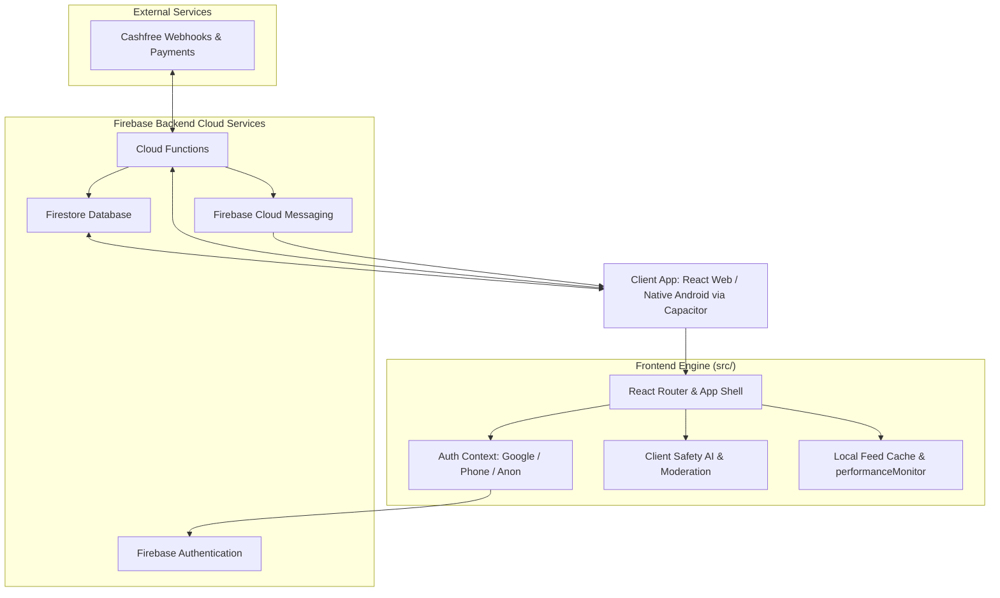

# SoulThread Sanctuary: Project Capability & Architecture Report

SoulThread is a premium, anonymous mental health sanctuary and emotional sharing platform. Built specifically to counter the stresses of modern digital life, it connects users with peer support networks, professional "Soul Guides", and immersive self-improvement series, while providing a 100% anonymity guarantee.

---

## 🗺️ System Architecture

Below is a high-level view of SoulThread's system flow, detailing how the web client and native Android app interface with Firebase, local client utilities, and payment processing nodes.

---

## 🛠️ What We Are Doing: Core Objectives

We are currently engineering the foundation for SoulThread's public release. The active work is grouped into four core pillars:

1. **Rebranding & Content Seeding**:
   - Populating Firestore with deep-seated, category-specific content focusing on Anxiety, Relationship struggles, and Economic challenges.
   - Custom seeding scripts leverage realistic data distributions to ensure the platform feels alive and supportive from Day 1.
2. **SEO & Public Discovery Optimization**:
   - Injecting structured JSON-LD SEO schemas (WebSite, Organization, and FAQPage formats) directly on major landing paths for search crawler readability.
   - Dynamic sitemap generation to drive search engine indexing.
3. **Android Native Compilation & Security**:
   - Implementing build configurations using Capacitor to package the React 19 application into a secure Android bundle.
   - Enforcing screenshots and screen recording blocks inside the native shell to safeguard user privacy.
4. **Monetization & Verified Guide Workflows**:
   - Structuring secure paywalls and appointment schedules linking with the Cashfree payment gateway webhook processor.
   - Distinguishing client-facing reads from Cloud Function-validated writes to secure subscription states.

---

## 🌟 Current Capabilities & Features

### 1. The Anonymous Community Feed
*   **Encrypted Venting**: Users can post thoughts, tag them with emotional categories, and comment on peer shares without exposing names, email addresses, or real-life credentials.
*   **Dynamic Avatar Engine**: Users receive unique, randomly seeded avatar illustrations on sign-up (powered by DiceBear).
*   **Performance Optimization**: High-speed, local caches (`feedCache.js`) and deferred background counts prioritize loading the community timeline.
*   **Search and Explore**: Custom classification and text searching across user posts.

### 2. Multi-Layer AI & Safety Nets
*   **Fast Keyword & Regex Filtering**: Incoming content is validated in `< 1ms` against a multi-risk dictionary (Abuse, hate-speech, and severe profanity).
*   **Empathetic Risk Scoring**:
    - `LOW`: Logged silently without user interruption.
    - `MEDIUM`: The user is gently warned with a prompt asking if they would like to revise their phrasing.
    - `HIGH`: The post is blocked and sent to the moderator queue.
*   **Crisis Detection Gateway**: Detects self-harm or suicidal triggers immediately and presents active crisis line cards (e.g., iCall India, Vandrevala Foundation, Snehi) directly in the UI.
*   **AI Companion Guide**: An interactive wellness companion designed to validate user emotions without diagnosing, with hardcoded crisis escalation overrides.

### 3. Transformation & Growth Library (150+ Lessons)
SoulThread features an interactive learning series suite where users can progress through structured daily steps. Key programs include:
*   **Neuroscience**:
    *   *Hyperfocus Architect* (30 days of neuroscience-based attention protocols)
    *   *Memory Architect* (30 days of science-based recall mastery)
*   **Psychology & Mindset**:
    *   *Never Finished* (30-day boot camp inspired by mental toughness principles)
    *   *The Ego and the Id* (Understanding Freud's psyche model in Hindi)
    *   *Prompt Architect* (Advanced human-to-AI prompt engineering instruction)
*   **Meditation & Well-Being**:
    *   *Inner Bloom: Meditation* (3-level sensorimotor mindfulness guides)
    *   *The Biological Soul* (Behavioral science course based on Stanford's Human Biology curriculum)
*   **Relationships & Intimacy**:
    *   *Relationship Mastery* (Modern dating and attachment psychology)
    *   *Lust Decoded* (18+ guide to attraction patterns and intimacy shifts)

### 4. Counselor & Guide Marketplace
*   **Soul Guides Directory**: Users can search and connect with certified, verified psychologists and therapists.
*   **Encrypted Consultations**: Audio/text rooms allow users to book sessions and talk anonymously with professionals.
*   **Secure Payment Validation**: Cashfree integration automatically updates Firestore booking slots and subscription profiles on verified server-side callbacks.

---

## 🗃️ Codebase Directory Mapping

For developers and contributors, here is how the core systems are laid out:

### Key Pages
*   [App.jsx (Routing)](file:///c:/Users/ojhar/soulthread/src/App.jsx): Houses routes and controls immersive-view overrides (hides navigation inside structured series).
*   [Home.jsx (Sanctuary Feed)](file:///c:/Users/ojhar/soulthread/src/pages/Home.jsx): Main community feed with topic filtering and the compose trigger.
*   [SeriesGallery.jsx (Insights)](file:///c:/Users/ojhar/soulthread/src/pages/SeriesGallery.jsx): Transformation gallery showing course listings and progress bars.
*   [Crisis.jsx (Helpline Gateway)](file:///c:/Users/ojhar/soulthread/src/pages/Crisis.jsx): One-tap gateway containing crisis resources and expert referrals.
*   [Chat.jsx (Secure Messages)](file:///c:/Users/ojhar/soulthread/src/pages/Chat.jsx): Messaging client featuring voice recording and voice notes playback.

### State & Auth Context
*   [AuthContext.jsx](file:///c:/Users/ojhar/soulthread/src/contexts/AuthContext.jsx): Orchestrates Credential Manager for Google Popups, native/web Phone verification, anonymous sign-in, and onboarding states.

### Core Services
*   [aiModeration.js](file:///c:/Users/ojhar/soulthread/src/services/aiModeration.js): Performs content filtering and tags risk vectors.
*   [aiCompanion.js](file:///c:/Users/ojhar/soulthread/src/services/aiCompanion.js): Powers the conversational wellness companion.
*   [e2eCrypto.js](file:///c:/Users/ojhar/soulthread/src/services/e2eCrypto.js): Encryption utilities securing anonymous chats.
*   [performanceMonitor.js](file:///c:/Users/ojhar/soulthread/src/services/performanceMonitor.js): Measures web vitals, latency, and system load.
*   [uploadPipeline.js](file:///c:/Users/ojhar/soulthread/src/services/uploadPipeline.js): Resumable chunked uploads for rich media assets.

### Cloud Functions
*   [index.js (Backend Entry)](file:///c:/Users/ojhar/soulthread/functions/index.js): Exports triggers including askSoulGuide, payments, invite management, and cron schedules.
*   [payments.js (Webhook Logic)](file:///c:/Users/ojhar/soulthread/functions/payments.js): Integrates payment validation scripts and structures subscription records.
*   [growth_automation.js](file:///c:/Users/ojhar/soulthread/functions/growth_automation.js): Handles daily prompt rotations, weekly digests, and re-engagement notifications.
